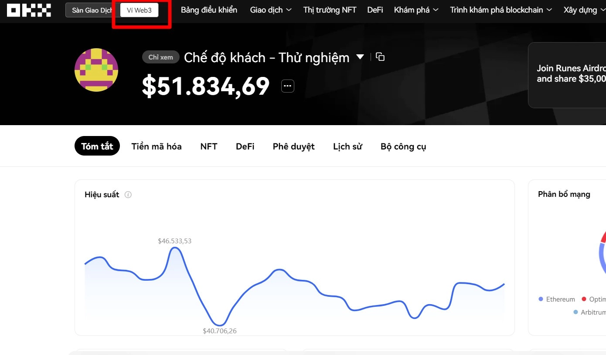
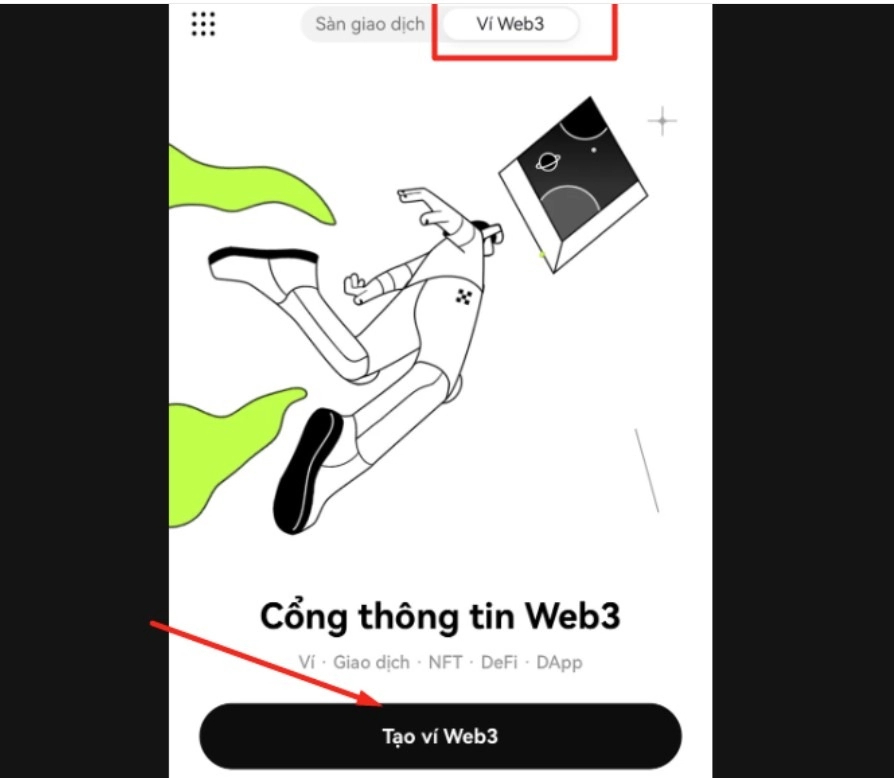

# OKX Web3 钱包完全指南：新手也能轻松上手的多链钱包

最近在加密货币圈子里，OKX Web3钱包的热度直线上升——不是因为它有什么花里胡哨的功能，而是因为它确实在解决一个让人头疼的问题：管理多条链上的资产太麻烦了。

如果你也厌倦了为不同的区块链网络创建一堆钱包，或者想尝试Web3世界里那些有趣的DApp和空投活动，这篇文章会告诉你OKX Web3钱包到底是什么，以及如何用它来让你的加密生活变得简单一些。

---

## OKX Web3钱包是什么？

简单来说，OKX Web3钱包是一个去中心化的多链钱包，让你可以用一个钱包管理多条区块链上的资产。

它支持超过50个区块链网络，包括以太坊、BSC、Arbitrum、zkSync、Aptos等等。你只需要一套助记词，就能在这些网络上创建地址、管理资产、使用DApp。不用再为每条链单独创建钱包，也不用在不同的钱包应用之间来回切换。

更重要的是，它还集成了去中心化交易所（DEX）、跨链桥、NFT市场、质押挖矿等功能。你可以在钱包里直接完成大部分Web3操作，而不用跳转到各种第三方网站。

**关于"去中心化"这件事**

去中心化意味着你完全掌控自己的资产和私钥。OKX不会帮你保管密码或助记词，也无法帮你找回丢失的私钥。这听起来有点吓人，但其实就是一个简单的道理：你的资产你做主，但你也要为自己的安全负责。

所以使用前需要注意：

- 务必备份好助记词（12个单词），这是恢复钱包的唯一方式
- 设置一个强密码，并妥善保管
- 对陌生的授权请求保持警惕，很多骗局就是从"随便点个确认"开始的
- 不要点击来路不明的链接或下载未验证的软件

## 为什么要用OKX Web3钱包？

**完全掌控自己的资产**

你的币真正属于你，不需要通过任何平台审批就能自由转账或使用。

**一个钱包管理多条链**

用一套助记词就能管理以太坊、BSC、Arbitrum等50多个网络上的资产。不用再记一堆密码，也不用在不同钱包之间倒腾。

**覆盖主流设备**

iOS、Android、浏览器扩展都支持，在手机上创建的钱包可以直接导入到电脑浏览器使用。

**集成丰富的Web3功能**

- 多链DEX交易和跨链兑换
- NFT市场交易
- 质押挖矿
- DApp浏览器
- Inscription（铭文）交易

## OKX Web3 Marketplace的核心功能

1. **NFT交易**：在多个区块链上搜索和交易NFT收藏品
2. **Inscription（铭文）**：支持比特币Ordinals上的BRC-20代币交易
3. **Crypto场外交易**：支持多种代币的OTC交易
4. **Drops活动**：参与空投活动，免费获取NFT白名单或代币
5. **搜索功能**：快速查找多网络上的NFT收藏品
6. **NFT Studio**：自己创建和发布NFT收藏系列
7. **购物车**：批量购买NFT，一次性完成交易
8. **个人主页**：查看持有的NFT和进行中的交易订单

👉 [立即体验OKX Web3钱包，探索更多Web3机会](https://www.okx.com/join/62834398)

## 如何创建OKX Web3钱包

### 手机端创建步骤

使用OKX Web3钱包的前提是需要注册OKX交易所账户。

**步骤1**：下载OKX App并登录账户

**步骤2**：点击底部导航栏的"Web3钱包"

**步骤3**：点击"创建钱包"

**步骤4**：系统会生成12个助记词，务必按顺序抄写并保存在安全的地方

**步骤5**：按顺序确认助记词后点击"完成"

钱包创建完成。整个过程不超过3分钟。

### 电脑浏览器扩展创建步骤

**步骤1**：打开Chrome浏览器

**步骤2**：访问Chrome网上应用店，搜索"OKX Web3 Wallet"并添加到浏览器

**步骤3**：选择"创建新钱包"或"导入已有钱包"

如果你已经在手机端创建了钱包，可以直接使用之前保存的12个助记词导入，这样手机和电脑就能使用同一个钱包了。

## 关于OKX交易所

由于使用OKX Web3钱包需要先注册OKX交易所账户，这里简单介绍一下。

**注册流程**

访问OKX官网，点击"注册"，填写邮箱和密码，完成邮箱验证和安全设置即可。需要准备手机号接收验证码。

**充值方式**

可以从其他钱包转入加密货币，也可以使用法币（如人民币）通过银行卡或第三方支付充值。

**交易费率**

- 现货交易：0.08% - 0.1%（根据30天交易量）
- 合约交易：挂单0.02% - 0.06%，吃单0.01% - 0.03%
- 提现费用：$8 - $35不等，取决于币种

持有OKB代币可以享受交易费折扣。

**界面和功能**

OKX支持中文界面，提供现货、合约、期权、质押等多种交易方式。新手和专业交易者都能快速上手。

👉 [注册OKX账户，开启Web3之旅](https://www.okx.com/join/62834398)

## 关于OKB代币

OKB是OKX平台的原生代币（基于ERC-20标准），可以用来支付交易手续费、提现费用等，持有者还能享受费率优惠。

有意思的是，OKB采用通缩机制：每个季度，OKX会用30%的现货交易手续费收入从市场回购OKB并销毁。随着时间推移，OKB的总量会逐渐减少。

除了费率折扣，持有OKB还能参与质押获得收益，以及享受其他平台活动的优先权。

## OKX可靠吗？

**优势**

- 运营多年，全球知名交易所之一，用户基础稳定
- 支持超过300种加密货币和500多个交易对
- 投入大量资源构建安全系统，包括冷钱包存储、多重签名等
- 中文界面友好，客服响应及时

**需要注意的地方**

- 去中心化钱包意味着你要对自己的资产安全负责
- 加密货币市场波动大，需要理性投资
- 部分地区可能有监管限制

总的来说，OKX在业内算是比较靠谱的平台，但任何投资都有风险，建议从小额开始尝试。

---

## 写在最后

OKX Web3钱包最大的价值在于它简化了Web3的使用门槛。你不需要成为技术专家，也能轻松管理多链资产、参与DeFi和NFT活动。

对于想探索Web3世界但又觉得门槛太高的人来说，OKX Web3是个不错的起点。它的多链支持、内置DEX和NFT市场能覆盖你在Web3世界的大部分需求。

如果你是加密货币新手，想找一个稳定可靠的平台开始你的Web3之旅，[不妨试试OKX](https://www.okx.com/join/62834398)——邀请码 **62834398** 可以享受手续费优惠。

记住最重要的一点：保管好你的助记词，它比任何密码都重要。
